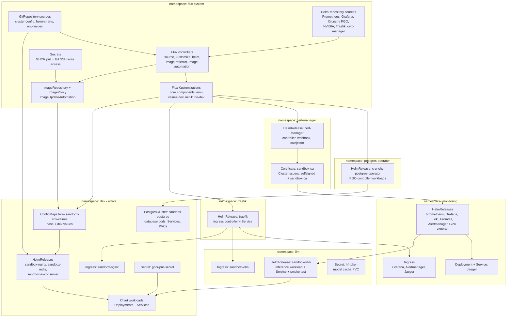
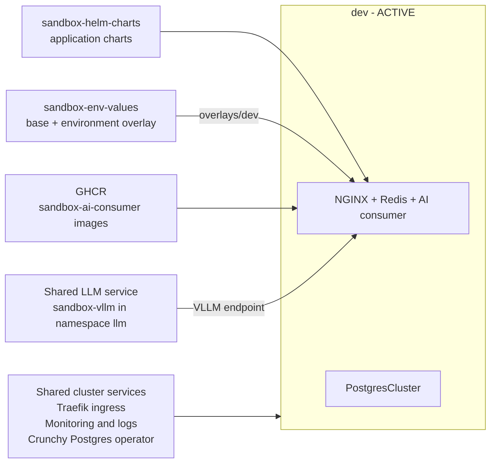
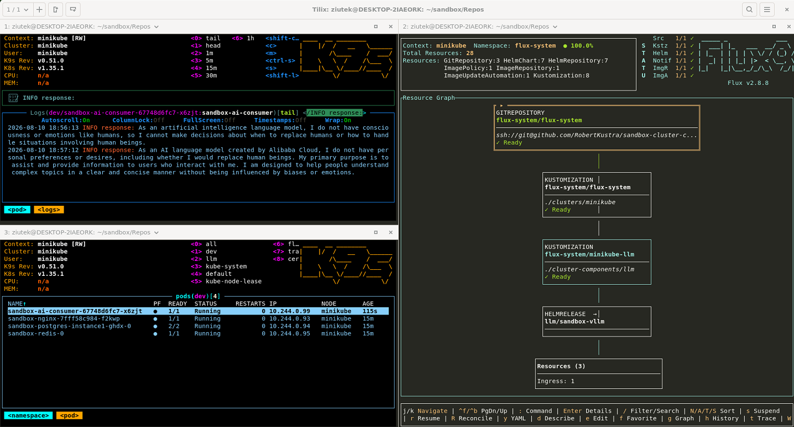

# Sandbox Documentation

This repository contains high-level usage documentation for the Sandbox workspace built from the `sandbox-*` repositories. To prepare `home-lab` with Kubernetes & GitOps implementation.

> **Remember**: the solution contained here are dedicated ONLY and exclusively for local testing of Kubernetes + LLM + GitOps.

## Repositories in the Workspace

- [sandbox-cluster-config](https://github.com/RobertKustra/sandbox-cluster-config) - Flux GitOps cluster configuration for Minikube, environment manifests, namespaces, apps and monitoring.
- [sandbox-helm-charts](https://github.com/RobertKustra/sandbox-helm-charts) - shared Helm charts for the sandbox apps, including `sandbox-nginx`, `sandbox-redis`, and `sandbox-vllm`.
- [sandbox-env-values](https://github.com/RobertKustra/sandbox-env-values) - shared base values plus environment overlays used by Flux HelmReleases for dev, test, and prod.
- [wsl-config](https://github.com/RobertKustra/wsl-config) - WSL configuration helpers.

### Current cluster-config structure

```text
sandbox-cluster-config/
|-- apps/                          # Per-service HelmRelease bases and environment overlays
|   |-- sandbox-ai-consumer/
|   |-- sandbox-nginx/
|   `-- sandbox-redis/
|-- bootstrap/flux-system-template/ # Reference bootstrap manifests
|-- cluster-components/            # Shared cert-manager, Traefik, monitoring, LLM and operator stages
|-- clusters/minikube/
|   |-- environments/              # dev, test and prod workload stages
|   |-- flux-system/               # Active Flux bootstrap and automation manifests
|   `-- kustomization.yaml         # Active Minikube entrypoint
|-- postgres/                      # PostgresCluster base and environment overlays
|-- scripts/                       # Local setup helpers
|-- sources/                       # External Git and Helm sources
`-- utils/operators/postgres/      # PostgreSQL operator resources
```

The entrypoint includes external sources, Flux system resources, selected shared components, and selected environment stages. Definitions for `dev`, `test`, and `prod` exist, but the current Minikube entrypoint enables only `dev`. Monitoring and LLM are shared cluster components rather than application environments.

### Bonus 
1. Simple app for LLM as consumer
    - [sandbox-ai-consumer](https://github.com/RobertKustra/sandbox-ai-consumer)
2. Scaffold environments 
    - [sandbox-scaffolder](https://github.com/RobertKustra/sandbox-scaffolder) - separate scaffold tool used to generate and sync environment manifests for `sandbox-cluster-config` and `sandbox-env-values`.

## Scaffold workflow

Environment scaffolding is handled by the separate `sandbox-scaffolder` repository.

Its main purpose is to:

- read a `cluster-config.yaml` input file
- generate or update environment manifests in `sandbox-cluster-config`
- generate or update matching overlays in `sandbox-env-values`
- optionally regenerate Flux `sandbox-env-values-<env>` kustomizations from currently enabled cluster environments


## CI/CD and pipeline overview

The sandbox workspace uses GitHub Actions pipelines in the application repositories to automate validation and image publishing.

### sandbox-ai-consumer pipelines

In the `sandbox-ai-consumer` repository, the following workflows are available:

- `Build and push Docker image` - builds and pushes the application container image to GHCR on pushes to `development` and `main`, and can also be triggered manually. The workflow checks out the repository, resolves the target environment and tag, logs in to GHCR, verifies whether the image already exists, and only then runs the build/push step. On `main`, it also creates a release Git tag after a successful publish.
- `Validate PR source policy` - validates pull requests against the repository promotion rules so that only allowed branch flows are merged. It blocks invalid PRs targeting `development` or `main` before they can be merged.

### Branch promotion flow

The expected promotion path is:

`feat/*` or `feature/*` -> `development` -> `main` with `release` tag

This ensures that changes are reviewed, validated, and promoted through the correct environments before release.

### Flux image automation

The Flux GitOps setup also includes image automation for application container images. The current active development flow uses:

- `clusters/minikube/environments/dev/image-reflector.yaml` for the `ImageRepository` and `ImagePolicy` that scan `ghcr.io/robertkustra/dev/sandbox-ai-consumer`.
- `clusters/minikube/flux-system/image-automation.yaml` for the `ImageUpdateAutomation` that writes the selected tag to `sandbox-env-values/overlays/dev`.

Once a new image is published to GHCR, Flux can detect it and commit the selected tag to the development values overlay, provided that `ghcr-pull-secret` is available in the `flux-system` namespace and the Git credentials permit writes to `sandbox-env-values`.

## What this setup does

This workspace defines a GitOps flow for a Minikube cluster using Flux. It provides:

- application environment definitions for `dev`, `test`, and `prod`; currently only `dev` is enabled
- shared cluster components for monitoring and LLM workloads
- Helm chart deployments managed by Flux
- shared and environment-specific Helm values stored separately from cluster configuration
- a monitoring stack with Prometheus, Grafana, Loki/Promtail, and Alertmanager
- Traefik Ingress routes for application and monitoring access

>**Warning:**  If your computer does not have a dedicated NVIDIA graphics processor that supports CUDA, do not install the `llm` and `ai-consumer` modules. The procedure is described later in this documentation.

## Architecture diagrams

The diagrams below represent resources enabled by `sandbox-cluster-config/clusters/minikube/kustomization.yaml`. HelmReleases and the Postgres operator create additional Deployments, StatefulSets, DaemonSets, Services, Jobs, and storage resources from their charts and custom resources.

### Active cluster resources



### Environment composition

The diagram includes only the `dev` environment referenced by the active Minikube entrypoint.



## How to use it

### 1. Prepare the workspace

Clone or open the workspace containing all `sandbox-*` `wsl-config` repositories.

For this demo, you'll need WSL set up with Ubuntu.

Run the prerequisite script to install required packages:


```bash
chmod +x wsl-setup.sh
./wsl-setup.sh
```

The script installs the following packages for the demo environment:

- `build-essential`
- `curl`
- `file`
- `tilix`
- `docker-ce`, `docker-ce-cli`, `containerd.io`
- Homebrew for Linux
- `git`, `wget`, `zsh`, `tmux`, `neovim`, `python`, `libpq`, `htop`, `ripgrep`, `fd`, `fzf`, `bat`, `jq`, `awscli`, `k9s`, `docker`, `minikube`, `kubectl`, `flux`
- `kubectx` and `kubens`

### 2. Start Minikube

```bash
minikube start \
  -p minikube \
  --driver=docker \
  --container-runtime=docker \
  --gpus=all \
  --cpus=4 #minimum for Qwen/Qwen2.5-0.5B-Instruct, bigger models need more resources \
  --memory=4608mb #minimum for Qwen/Qwen2.5-0.5B-Instruct, bigger models need more resources

kubectl get node minikube \
  -o jsonpath='Allocatable: cpu={.status.allocatable.cpu} mem={.status.allocatable.memory} gpu={.status.allocatable.nvidia\.com/gpu}{"\n"}'

docker inspect minikube \
  --format 'NanoCPUs={{.HostConfig.NanoCpus}} MemoryBytes={{.HostConfig.Memory}}'

kubectl config current-context
```


### 3. Bootstrap Flux

The main Flux entrypoint is `sandbox-cluster-config/clusters/minikube`.

If you are bootstrapping Flux for the first time, use a command similar to:

```bash
export GITHUB_TOKEN=<your-github-token>
flux bootstrap github \
  --owner=RobertKustra \
  --repository=sandbox-cluster-config \
  --branch=development \
  --path=./clusters/minikube \
  --components-extra=image-reflector-controller,image-automation-controller \
  --personal \
  --ssh-key-algorithm=rsa \
  --ssh-hostname=github.com
```

If Flux is already installed and the repo is connected, verify the sync:

```bash
kubectl get pods -n flux-system
kubectl get kustomizations -A
kubectl get helmreleases -A
```

### 3a. Configure GHCR pull secrets

Create a GitHub Personal Access Token (PAT) with the `read:packages` permission.

Set your GitHub username and PAT locally, then create the `ghcr-pull-secret` secret in the `flux-system` namespace:

```bash
export GHCR_USERNAME=<your-github-username>
export GHCR_PAT=<your-github-pat>

kubectl create secret docker-registry ghcr-pull-secret \
  --namespace=flux-system \
  --docker-server=ghcr.io \
  --docker-username="$GHCR_USERNAME" \
  --docker-password="$GHCR_PAT"
```

The same secret must exist in every enabled environment namespace that pulls images from GHCR, for example `dev`, `test`, and `prod`. Create the namespaces first if they do not exist, then run:

```bash
for namespace in dev test prod; do
  kubectl create secret docker-registry ghcr-pull-secret \
    --namespace="$namespace" \
    --docker-server=ghcr.io \
    --docker-username="$GHCR_USERNAME" \
    --docker-password="$GHCR_PAT"
done
```

> **Assumptions**: Only include namespaces enabled for the current cluster. Do not commit the PAT or the generated Secret manifests to Git in plaintext. For `MINIKUBE` example as `home-lab` you can use one `PAT` for all tested envs, but for `REAL SCENARIO` each envs should be isolated from each others. You should also consider using a secrets operator, i.e. `External Secret` + `Key Vault`/`Hashicorp Vault`/`AWS Secret Manager`/etc.

### 3b. Configure SSH write access for Flux image automation

Flux image automation commits updated image tags to the `development` branch of the `sandbox-env-values` repository. Create a dedicated SSH key and add its public key in GitHub under `sandbox-env-values` > **Settings** > **Deploy keys** with **Allow write access** enabled:

```bash
TMP_DIR="$HOME/.ssh"
KEY_FILE="$TMP_DIR/id_ed25519_flux_image_automation"
mkdir -p "$TMP_DIR"
ssh-keygen -t ed25519 -a 100 \
  -C "flux-image-automation" \
  -f "$KEY_FILE" \
  -N ""
ssh-keyscan -H github.com >> "$TMP_DIR/known_hosts"

cat "$KEY_FILE.pub"
```

After adding the displayed public key to GitHub, create the secret referenced by `GitRepository/sandbox-env-values` in the `flux-system` namespace:

```bash
kubectl -n flux-system create secret generic sandbox-env-values-write \
  --from-file=identity="$KEY_FILE" \
  --from-file=identity.pub="$KEY_FILE.pub" \
  --from-file=known_hosts="$TMP_DIR/known_hosts" \
  --dry-run=client -o yaml | kubectl apply -f -
```

Verify the source and image automation after creating the secret:

```bash
flux reconcile source git sandbox-env-values -n flux-system
flux get image update -n flux-system
```

> **Production consideration**: This local `home-lab` example uses a key without a passphrase. For a real environment, consider encrypting the private key with a strong passphrase and adding it to the Kubernetes Secret as the `password` field. Flux can then decrypt the key automatically without an interactive prompt. Protect the Secret with an appropriate secrets management solution and access controls.

*Do not commit* the private SSH key or the generated Secret manifest to Git.

### 4. Deploy and verify environments

The repository contains separate application stages for:

- `dev` - `clusters/minikube/environments/dev`
- `test` - `clusters/minikube/environments/test`
- `prod` - `clusters/minikube/environments/prod`

Only stages referenced by `clusters/minikube/kustomization.yaml` are deployed; currently this is `dev`. Shared services use separate Flux stages:

- `monitoring` - `cluster-components/monitoring.yaml`, deploying `cluster-components/monitoring`
- `llm` - `cluster-components/llm.yaml`, deploying `cluster-components/llm`

Each application stage composes service-specific overlays under `apps/<service>/overlays/<env>` and the matching `postgres/overlays/<env>`.

For example, the dev environment deploys:

- `apps/sandbox-nginx/overlays/dev`
- `apps/sandbox-redis/overlays/dev`
- `apps/sandbox-ai-consumer/overlays/dev`
- `postgres/overlays/dev`

### 5. Access services

Current host names configured in the repo:

- `sandbox-nginx.dev.local`
- `sandbox-nginx.test.local`
- `sandbox-nginx.prod.local`
- `sandbox-vllm.llm.local`
- `grafana.monitoring.local`
- `alertmanager.monitoring.local`

You may need to add these entries to your `/etc/hosts` file to resolve them locally, or use simple Port-Forward.

### 5a. vLLM Hardware Requirements

The `sandbox-vllm` service requires specific hardware to operate properly. The requirements vary depending on the model size and inference parameters.

#### Known Issues

During the first cluster startup, pulling the `vllm/vllm-openai` image may take a long time. As a result, the `sandbox-vllm` HelmRelease and its dependent `minikube-llm` Kustomization may time out. This can prevent the `dev`, `test`, and `prod` environments from being deployed, even after the local vLLM model has started successfully.

After the image has been pulled and vLLM is running, force reconciliation in dependency order:

```bash
flux reconcile hr sandbox-vllm --with-source --force -n llm
flux reconcile kustomization minikube-llm --with-source -n flux-system
```

#### Current Configuration

> **Warning:** Depending on your local machine, you need to adjust the following parameters to the available resources

For this case, it was tested host with the folowing stats:

```
- CPU: Intel i9 13th
- RAM: 32GB
- GPU: RTX 4090 Mobile 16GB
- DISK: 2Tb
```

The sandbox setup uses a minimal profile:

- **Model**: `Qwen/Qwen2.5-0.5B-Instruct` (0.5B parameters)
- **GPU**: 1x NVIDIA GPU (6GB VRAM minimum, 8GB+ recommended)
- **CPU**: 250m (request) / 1 core (limit)
- **Memory**: 512Mi (request) / 1536Mi (limit)
- **Storage**: 30Gi persistent volume for model cache (`/root/.cache/huggingface`)
- **Shared Memory**: 512Mi `/dev/shm` mount

#### Minimum Hardware Requirements

| Component | Minimum | Recommended |
|-----------|---------|-------------|
| GPU | 6GB VRAM | 8GB+ VRAM |
| CPU Cores | 1 | 2-4 |
| System RAM | 4Gi | 8Gi+ |
| Storage | 30Gi | 50Gi+ (for multiple models) |
| Shared Memory (/dev/shm) | 512Mi | 1Gi+ |

#### GPU Memory Considerations

- **Smaller models (0.5B-3B parameters)**: 4-12GB VRAM sufficient
  - Example: `Qwen/Qwen2.5-0.5B-Instruct`
  - Max model length: 512-2048 tokens
  - Max concurrent sequences: 1-2

- **Medium models (7B-13B parameters)**: 16GB VRAM minimum
  - Max model length: 2048 tokens
  - Max concurrent sequences: 1-2

- **Larger models (30B+ parameters)**: 24GB+ VRAM
  - Consider quantization (4-bit, 8-bit) for lower VRAM usage

#### Key Tuning Parameters

Located in [sandbox-cluster-config/cluster-components/llm/sandbox-vllm.yaml](https://github.com/RobertKustra/sandbox-cluster-config/blob/development/cluster-components/llm/sandbox-vllm.yaml):

- `--dtype half` - Use float16 to reduce memory usage (vs float32)
- `--gpu-memory-utilization 0.35` - Allocate 35% of GPU VRAM for model/cache; lower than this may fail model init
- `--max-model-len 512` - Keep context very small to reduce KV cache usage
- `--max-num-seqs 1` - Single concurrent sequence to minimize memory pressure
- `--enforce-eager` - Lower memory pressure at the cost of performance
- `PYTORCH_CUDA_ALLOC_CONF=expandable_segments:True` - Enable memory fragmentation mitigation

#### Out-of-Memory (OOM) Mitigation

If experiencing OOM errors even with this minimal profile:

1. Reduce `--gpu-memory-utilization` from 0.35 to 0.30
2. Keep `--max-num-seqs=1` and reduce `--max-model-len` to `256`
3. Keep a very small model only (1B class)
4. Ensure `PYTORCH_CUDA_ALLOC_CONF=expandable_segments:True,max_split_size_mb:64` is set
5. If the host still restarts, disable the `llm` environment entirely on this machine

#### Deployment Without a Dedicated GPU

> **Warning:** If your machine does not have a dedicated NVIDIA GPU that supports CUDA, do **not** deploy the `llm` environment and do **not** deploy `sandbox-ai-consumer` in any environment (`dev`, `test`, `prod`). Without GPU support vLLM will fail to start and `sandbox-ai-consumer` will loop on connection errors.

To disable these components, comment out or remove the relevant entries in the following files:

1. **Disable the shared `llm` component** - remove the reference from the cluster kustomization:

   - File: [sandbox-cluster-config/clusters/minikube/kustomization.yaml](https://github.com/RobertKustra/sandbox-cluster-config/blob/development/clusters/minikube/kustomization.yaml)
   ```yaml
   resources:
     # - ../../cluster-components/llm.yaml   # comment out when no GPU is available
   ```

2. **Disable `sandbox-ai-consumer` in a selected environment** - remove the app overlay from the environment kustomization:

   - File: [sandbox-cluster-config/clusters/minikube/environments/dev/kustomization.yaml](https://github.com/RobertKustra/sandbox-cluster-config/blob/development/clusters/minikube/environments/dev/kustomization.yaml)
   - File: [sandbox-cluster-config/clusters/minikube/environments/test/kustomization.yaml](https://github.com/RobertKustra/sandbox-cluster-config/blob/development/clusters/minikube/environments/test/kustomization.yaml)
   - File: [sandbox-cluster-config/clusters/minikube/environments/prod/kustomization.yaml](https://github.com/RobertKustra/sandbox-cluster-config/blob/development/clusters/minikube/environments/prod/kustomization.yaml)
   ```yaml
   resources:
     # - ../../../../apps/sandbox-ai-consumer/overlays/<env>   # remove/comment for chosen env
   ```

   Note: in the current repo state, `test` already does not include `sandbox-ai-consumer`.

3. **Update the matching Flux Kustomization for that environment** - remove `sandbox-ai-consumer` health check, and remove `minikube-llm` dependency if it is no longer needed:

   - File: [sandbox-cluster-config/clusters/minikube/environments/dev.yaml](https://github.com/RobertKustra/sandbox-cluster-config/blob/development/clusters/minikube/environments/dev.yaml)
   - File: [sandbox-cluster-config/clusters/minikube/environments/test.yaml](https://github.com/RobertKustra/sandbox-cluster-config/blob/development/clusters/minikube/environments/test.yaml)
   - File: [sandbox-cluster-config/clusters/minikube/environments/prod.yaml](https://github.com/RobertKustra/sandbox-cluster-config/blob/development/clusters/minikube/environments/prod.yaml)
   ```yaml
   spec:
     dependsOn:
       # - name: minikube-llm   # remove if no workload in this env depends on llm
     healthChecks:
       # remove sandbox-ai-consumer HelmRelease check for the same env
   ```

After committing these changes Flux will skip the GPU-dependent components and all remaining environments will reconcile normally.

#### Cluster Resource Reservation

Ensure your Minikube instance has sufficient resources:

```bash
minikube start \
  -p minikube \
  --driver=docker \
  --container-runtime=docker \
  --gpus=all
  --cpus=4 #minimum for Qwen/Qwen2.5-0.5B-Instruct, bigger models need more resources
  --memory=4608mb #minimum for Qwen/Qwen2.5-0.5B-Instruct, bigger models need more resources

kubectl get node minikube \
  -o jsonpath='Allocatable: cpu={.status.allocatable.cpu} mem={.status.allocatable.memory} gpu={.status.allocatable.nvidia\.com/gpu}{"\n"}'

docker inspect minikube \
  --format 'NanoCPUs={{.HostConfig.NanoCpus}} MemoryBytes={{.HostConfig.Memory}}'
```

For WSL2 with NVIDIA GPU passthrough, configure in your `.wslconfig`:

```ini
[wsl2]
memory=16GB
processors=8
guiApplications=true
gpuSupport=true
```

### 5b. Test sandbox-vllm on Minikube

Use this flow to validate the LLM service exposed in the `llm` namespace.

1. Verify service and pod are running:

```bash
kubectl -n llm get svc,pods
```

Expected service name:

- `sandbox-vllm` on port `8000`

2. Start port-forward from local machine to the cluster service:

```bash
kubectl -n llm port-forward svc/sandbox-vllm 8000:8000
```

Leave this command running in a separate terminal.

3. Run quick API checks from another terminal:

```bash
curl -i http://127.0.0.1:8000/health
curl -s http://127.0.0.1:8000/v1/models | jq .
```

4. Send a sample chat completion request:

```bash
curl -s http://127.0.0.1:8000/v1/chat/completions \
  -H 'Content-Type: application/json' \
  -d '{
    "model": "Qwen/Qwen2.5-0.5B-Instruct",
    "messages": [{"role": "user", "content": "Write a Bash script that displays the contents of the default system variables."}],
    "temperature": 0.8,
    "max_tokens": 120
  }' | jq .
```

5. Optional stress test (parallel requests):

```bash
model="Qwen/Qwen2.5-0.5B-Instruct"
count=10
parallel=1

seq 1 "$count" | xargs -I{} -P "$parallel" bash -lc '
  i={}
  out=$(curl -sS -o /tmp/vllm_test_$i.json -w "%{http_code} %{time_total}" http://127.0.0.1:8000/v1/chat/completions \
    -H "Content-Type: application/json" \
    -d "{\"model\":\"'"$model"'\",\"messages\":[{\"role\":\"user\",\"content\":\"Test #$i: Write 6 words about AI\"}],\"temperature\":0.7,\"max_tokens\":64}")
  echo "$i $out"
' | tee /tmp/vllm_parallel_results.txt

awk '{c[$2]++} END{for (k in c) print k, c[k]}' /tmp/vllm_parallel_results.txt | sort -n
```

If the status summary is mostly `200`, the endpoint is healthy under this load.

### 6. Update charts and values

To change application behavior:

- edit Helm chart definitions in: 
  - `sandbox-helm-charts/charts/sandbox-nginx`
  - `sandbox-helm-charts/charts/sandbox-redis`
  - `sandbox-helm-charts/charts/sandbox-vllm`
  - `sandbox-helm-charts/charts/sandbox-ai-consumer`
- edit shared values in `sandbox-env-values/base` and environment overrides in `sandbox-env-values/overlays/dev`, `sandbox-env-values/overlays/test`, or `sandbox-env-values/overlays/prod`
- update shared app manifests in `sandbox-cluster-config/apps/<service>/base`
- update environment overlays in `sandbox-cluster-config/apps/<service>/overlays/<env>`
- update LLM manifests in `sandbox-cluster-config/cluster-components/llm`
- update monitoring manifests in `sandbox-cluster-config/cluster-components/monitoring`
- update PostgreSQL instances in `sandbox-cluster-config/postgres/base` and `postgres/overlays/<env>`

Then commit and push the changes, and let Flux reconcile the cluster.

## Repository details

### sandbox-cluster-config

This repository contains the Flux GitOps configuration:

- `clusters/minikube/kustomization.yaml` - cluster entrypoint selecting sources, components, and environments
- `clusters/minikube/flux-system` - active Flux bootstrap and automation resources
- `clusters/minikube/environments/*` - application environment stages and workload composition
- `apps/<service>/base` - shared HelmRelease and application resources
- `apps/<service>/overlays/<env>` - environment-specific application overlays
- `cluster-components/*` - shared cluster services and their Flux Kustomization stages
- `postgres/*` - shared and environment-specific PostgresCluster manifests
- `sources/*` - external GitRepository and HelmRepository definitions

Important components:

- `cluster-components/monitoring` - Prometheus, Grafana, Loki-stack, Promtail, Alertmanager, Jaeger, and GPU exporter resources
- `cluster-components/llm` - `sandbox-vllm` HelmRelease and ingress configuration
- `cluster-components/traefik` - Traefik installation resources
- `cluster-components/cert-manager` and `cluster-components/cert-manager-issuers` - certificate management resources

### sandbox-helm-charts

Contains reusable chart definitions used by Flux.

Current charts:

- `charts/sandbox-nginx` - NGINX-based app chart exposed via service and ingress
- `charts/sandbox-redis` - Redis chart used by the `sandbox-redis` HelmRelease in `sandbox-cluster-config`
- `charts/sandbox-vllm` - vLLM inference chart with a post-install/post-upgrade smoke-test hook
- `charts/sandbox-ai-consumer` - vLLM consumer worker chart using environment-driven runtime settings (`VLLM_*`)

### sandbox-env-values

Contains Helm values for each environment:

- `base/` - shared Helm values
- `overlays/dev/` - development overrides
- `overlays/test/` - test overrides
- `overlays/prod/` - production overrides

The repository contains `sandbox-ai-consumer` values for all three overlays. Deployment scope is controlled independently by the active stages in `sandbox-cluster-config`.

### wsl-config

Contains WSL-specific setup instructions and helper scripts for using the workspace under Windows Subsystem for Linux.

## Notes

- Traefik is used as the Ingress controller in this setup.
- The monitoring stack runs as the shared `minikube-monitoring` cluster component, independently of application namespaces.
- Flux applies the configuration from `sandbox-cluster-config` and references external sources from `sandbox-helm-charts` and `sandbox-env-values`.

## Next steps

- Add or modify application charts in `sandbox-helm-charts`
- Manage environment-specific settings in `sandbox-env-values`
- Add more environments or services under `sandbox-cluster-config`
- Use the existing `monitoring` app package to extend alerts and dashboards
- TODO: Configure Alertmanager notifications for Discord (webhook or relay) in `sandbox-cluster-config/cluster-components/monitoring/alertmanager.yaml`.

## Repository dependency diagram

The relationship between the core repositories is:

```text
sandbox-cluster-config
        |         \
        |          \
        |           \
        |            \
        v             v
sandbox-env-values   sandbox-helm-charts
```

- `sandbox-cluster-config` is the Flux GitOps entrypoint and references both:
  - `sandbox-env-values` for environment-specific Helm values
  - `sandbox-helm-charts` for Helm chart sources used by HelmReleases

This means `sandbox-cluster-config` orchestrates deployments using the other two repositories.

# Example output of `sandbox-ai-consumer`


